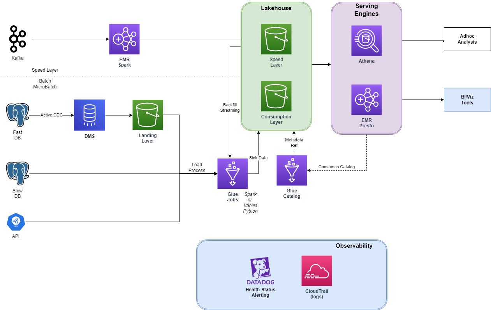

# Lambda Architecture Proposal

- [Lambda Architecture Proposal](#lambda-architecture-proposal)
  - [Architecture](#architecture)
  - [Sources](#sources)
    - [Speed Layer vs Batch/Microbatch Layer](#speed-layer-vs-batchmicrobatch-layer)
    - [DMS/Debezium vs Slow Postgres](#dmsdebezium-vs-slow-postgres)
  - [Ingestions](#ingestions)
    - [EMR](#emr)
    - [Glue Jobs](#glue-jobs)
  - [Lakehouse](#lakehouse)
    - [Storage](#storage)
    - [Glue Catalog](#glue-catalog)
  - [Serving](#serving)
    - [Athena](#athena)
    - [Presto](#presto)
  - [Observability](#observability)
  - [Extras](#extras)

## Architecture

  

## Sources

There are two critical sources there that are important to address differently:

- Kafka events are often or may be subject to a fast/speed layer and should be handled differently than everything else;
- Fast Postgres (<1h per extraction) may be a large source already or grow rapidly - so dealing the traditional way may not scale.

*Slower sources* may be extracted through the traditional, vanilla python, those two will demand a more scalable solution from start.

### Speed Layer vs Batch/Microbatch Layer

I've designed this architecture with a core idea in mind: Speed layers should be fast and simple to reduce latency - hence, there is a clear separation between those: 
* Microbatch layers can follow a standard/common pipeline, going through multiple lake layers such as landing and cleaned/curated tiers (which were omitted).
* Speed Layer has a straightforward serving zone and a specific living time, being processed/backfilled at the end of every day (subject to change) to the regular batch/lake structure.

### DMS/Debezium vs Slow Postgres

A reason for using DMS instead of fetching directly through Spark is that every change in the underlying database will produce a changelog/*binlog* that will be processed. This is useful when there are tables that have weird behaviours for tracking updates or data evolution, such as a non-reliable `updatedAt` column. As this data source has a quite fast sample time, It is more consistent to process a Change Data Capture feed rather than just query new data every time.  

Using DMS is also useful when you have to extract a Database source in a near real-time fashion.

For the slow Postgres, although the extraction could use the advantage of a CDC upsert, it won't be required and avoiding this approach at this moment is useful for reducing costs and keeping it simple. If there are too many large tables with inconsistent incremental behaviour, it could also be used with a DMS Task for processing it from time to time, which could be triggered through Lambda or some kind of orchestrator.

## Ingestions

Even though every ingestion could be centred inside Glue Jobs, three drawbacks can be proven difficult to work with:
- Glue Jobs are less flexible when it comes to specific jars versions;
- Glue Jobs are more expensive due to their serverless nature;
- Glue Jobs are limited in terms of machine instances to be set up.

So there are two proposed engines: EMR & Glue Jobs for dealing and ingesting data from those sources:

### EMR

While EMR also lags behind some official releases for almost every lib (e.g.: Apache HUDI), it is more versatile for setting up cluster instances and also using the advantages of AWS step functions, plus: a 24/7 job shouldn't rely upon a serverless service for consistency and sake of management.

Reading Kafka from Spark is quite straightforward by using Spark Structured Streaming and it has an *exactly-once* delivery. There is a disadvantage in this scenario, as Spark Structured Streaming does not commit the offset and uses its own way of checkpoint the persistence, this can lead to confusing consumer metrics from the Kafka standpoint.

### Glue Jobs
As stated, scheduled operations and vanilla (non-spark dependant) could make use of a simple setup and scheduling/orchestration and job dependency, without the burden to setup and even worry about orchestration and task dependency;

## Lakehouse

A lakehouse approach was decided upon noticing that Data should serve two different aspects:
- Data Science Modelling, training and supposedly sandboxing/POC development;
- Analytical Dashboards.

Keeping it into a Lakehouse approach reduces the burden and complexity of bringing new data, keeping the flexibility to handle data at will for both Data Science and modelling. In addition, it also keeps it flexible for sinking and processing this data to multiple other toolings.

### Storage

The file format should be along either Delta or Hudi - both implement a regular upsert operation and ACID-like structure at the same time keeping data in an optimized format such as Parquet (Hudi also may keep some data in a row format like Avro).

### Glue Catalog
Since AWS Glue started backing up several file/manifests formats, such as HUDi & Delta Lakes it makes it a viable option for a Data Catalog that also has some additional features such as Crawlers and a considerable prompt setup with Amazon Athena and even Redshift Spectrum.

PS: A Metastore catalogue is a must for every lakehouse approach, as most parts of the process are either working with Spark or an analytical query engine.

## Serving

### Athena

Athena is the way to go for ad-hoc & data exploring for Data Analytics. It is easy to set up with Glue & Lake structures while fast enough for serving. 
The cons are mostly due to the pricing being associated with the amount of data (GB) processed and being a "lagged" and being an AWS's encapsulated Presto instance.

### Presto

PS: This might not be needed if Athena pricing suits well the infrastructure - as there is some redundancy with Athena. In case the serving structure/modelling will be closer to normalized, relational structure, then using Redshift Spectrum is a better alternative for serving data.

Presto is fast and reliable for serving Datalake/Lakehouse files into production - mainly working with multiple machines and reading directly from S3, but referencing a Catalog/Metastore to do so.
While Presto/Trino are often the core query engine for lakehouse approaches, they also pose some scaling and management complexities which can also be a burden. An alternative could be using Starburst (managed Presto).

## Observability

Tracking the usage, job status and also cluster metrics (mainly from EMR) is extremely important when it comes to data pipelines. Every tiny bit of infrastructure should be tracked and as I have no clue whether all other stuff (PSQL & Kafka) are also within the managed AWS, I've decided to pick DataDog for tracking infrastructure metrics, alerts and incidents. 

CloudTrail is also listed as indexing every log in DataDog is expensive.

## Extras

There are some features that I didn't go through, but also should be taken into account:
- Data lake Layers and its responsibilities;
  - Including partitioning and optimization;
- Data Quality assurance;
- Data Modeling;
- Data Discovery.

Regards =)